# 9.11 作业

## ex01

[代码仓库地址](https://github.com/immorrrtal/DataScience2023)

## ex02

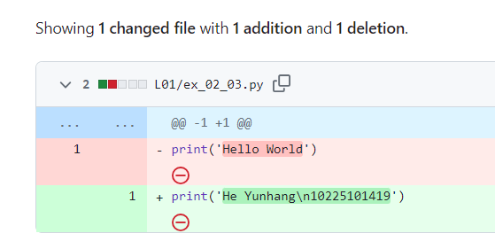

## ex03

## ex04

## ex05

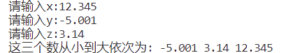

## ex06

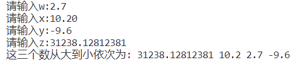

## ex07

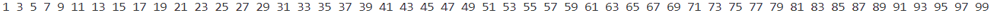

## ex08

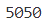

## ex09

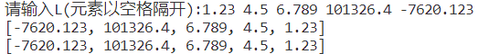

## ex10

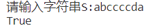

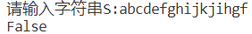

## ex11

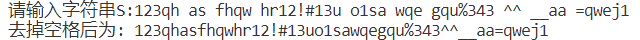

## ex12

对于本题，首先考虑输入数字绝对值的立方根，分类讨论大于1和小于1的情况，利用二分法不断逼近其值，误差小于0.0000001时认为得到的区间中点即为所求，最后加上符号即可。

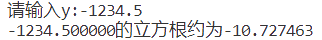

## ex13

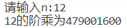