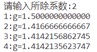

# 9.18 作业

## ex01

对于本题，定义n对应的正整数列的乘积为product[n]，使用动态规划，将每个正整数拆解为两个正整数i,j之和，记录product[i]*product[j]的最大值以及这种拆解对应的正整数列（即i,j对应序列的拼接），再特判不进行拆解的情形，实现递推

## ex02

## ex03

对于本题，将题目中十个状态点从左上至右下依次编号为0~9，建立矩阵表示连接关系，采用dfs算法遍历求得所有可行的状态转移路径，对应四种渡河方案

## ex04

## ex05

## ex06

由下图可知，所除系数的选取对最终结果无明显影响，只影响迭代次数

## ex07

c的三次方根的牛顿迭代式为 $x_{n+1}=x_{n}-{x_{n}^3-c \over 3x_{n}^2}$，c=10时迭代过程如下：

## ex08

对于本题，分别采用arctan级数、进行欧拉变换后的arctan级数、BBP公式逼近$\pi$的值，由结果可知BBP公式效率最高

## ex09

