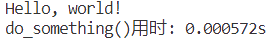

# 9.25 作业

## ex_3_01

## ex_3_02

## ex_3_03

## ex_3_04

## ex_3_05

## ex_3_06

## ex_3_07

## ex_3_08

由结果可见，数组规模较小时几种排序方式效率差异不大，而数组规模较大时，四种时间复杂度为 $O(nlogn)$ 的排序算法显著优于其他时间复杂度为 $O(n^{2})$ 的算法，其中，快速排序效果最好

## ex_3_09

对于本题，采取分治的算法，时间复杂度为 $O(nlogn)$

## ex_4_01

## ex_4_02

## ex_4_03

## ex_4_04

所给算法的时间复杂度为 $O(n^{2})$ ，空间复杂度为 $O(1)$