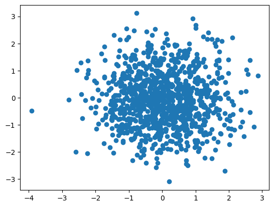
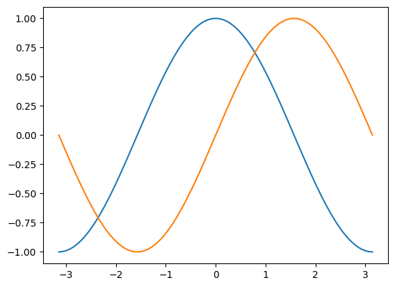
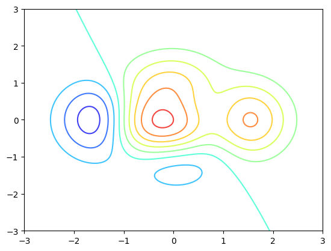
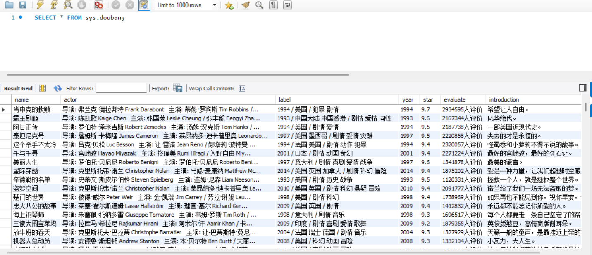
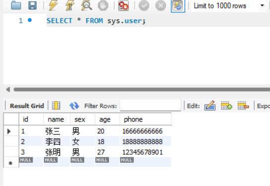
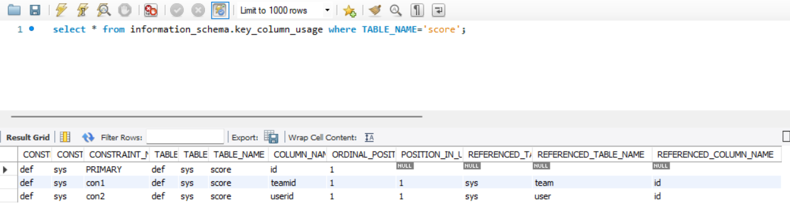
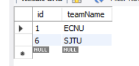
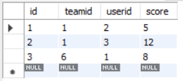

# 10.9 作业

## sect_06_7_1

爬取了豆瓣电影top250榜单并保存为csv，结果见 [douban.csv](./douban.csv)

## sect_06_7_2

## sect_07_5

已在mysql上完成

## ex_06_01

## ex_06_02

scrapy框架优点：
1. scrapy 是异步的，可以灵活调节并发量
2. 采取可读性更强的 xpath 代替正则，速度快
3. 写 middleware,⽅便写⼀些统⼀的过滤器
4. 同时在不同的 url 上爬⾏
5. ⽀持 shell ⽅式，⽅便独⽴调试
6. 通过管道的⽅式存⼊数据库，灵活，可保存为多种形式

scrapy框架缺点：
1. ⽆法⽤它完成分布式爬取
2. ⾃⾝去重效果差，消耗内存，且不能持久化
3. 对于需要执⾏js才能获取数据的⽹页，爱莫能助
4. 兼容了下载图⽚与视频，但是可⽤性⽐较差
5. ⾃⾝扩展的log模块，不好⽤，经常需要⾃定义
6. 基于 twisted 框架，运⾏中的 exception 是不会⼲掉 reactor（反应器），并且异步框架出错后 是不会停掉其他任务的，数据出错后难以察觉，预警系统简单的使⽤邮件，很不友好

## ex_06_03

使用scrapy框架爬取了 http://quotes.toscrape.com/ ,部分结果见 [quotes.json](./quotesbot/quotes.json)

## ex_06_04~05

使用scrapy框架爬取了 http://category.dangdang.com/cp01.54.00.00.00.00.html ,部分结果见 [output.json](./dangdang/output.json)

## ex_07_01~02

数据库使用MySQL Workbench，下题sql语句见对应py文件

## ex_07_03

## ex_07_04

## ex_07_05

## ex_07_06

## ex_07_07

## ex_07_08

## ex_07_09

## ex_07_10

