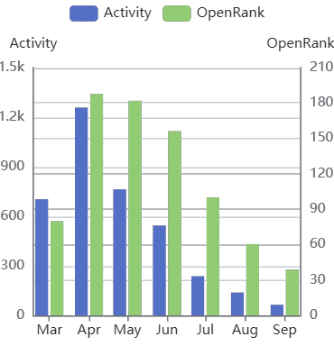
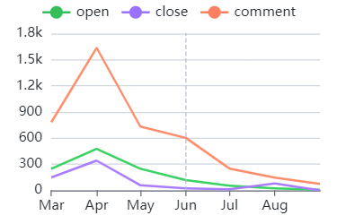
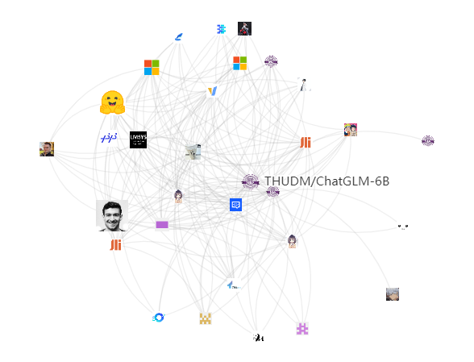
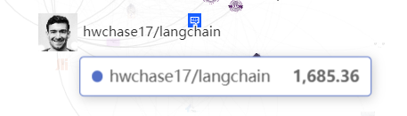
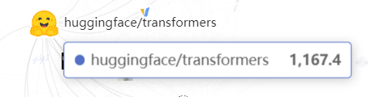
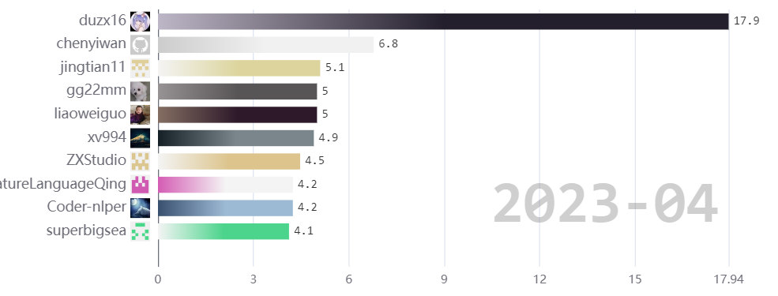
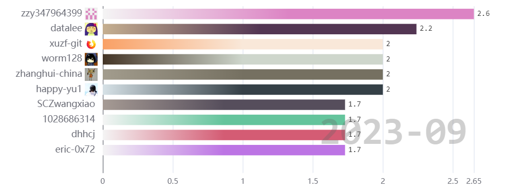
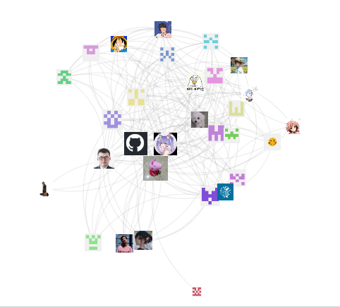

# ChatGLM开源项目探索

## 项目介绍

[ChatGLM-6B](https://github.com/THUDM/ChatGLM-6B) 是一个开源的、支持中英双语的对话语言模型，基于 [General Language Model (GLM)](https://github.com/THUDM/GLM) 架构。
ChatGLM-6B 使用了和 ChatGPT 相似的技术，针对中文问答和对话进行了优化。经过大量中英双语训练，辅以监督微调、反馈自助、人类反馈强化学习等技术的加持，62 亿参数的 ChatGLM-6B 已经能生成相当符合人类偏好的回答。

## 活跃度与OpenRank趋势

可见，该项目一经发布就获得了极大关注，而在六月，[第二代ChatGLM](https://github.com/THUDM/ChatGLM2-6B) 发布后本项目活跃度及OpenRank值有所下滑。下图依次为Issues、PR趋势图，也印证了这一点。

## 项目关系网络图

项目关系网络图展示了在给定的时间段内，项目与项目之间的联结关系，用于项目间关系的追踪与挖掘。从网络图中，可以找出与该项目有联结关系的其他项目。

- 节点：一个节点表示一个项目，节点大小与颜色的深浅表示项目活跃度的大小。
- 边：表示项目与项目之间存在联结关系，值的大小表示项目间联系的紧密程度。为了使网络图不至于太稠密，值小于 5 的边会被剪去。

上图为ChatGLM的项目关系网络图，查看最大的两个节点可知，与本项目最相关的两个项目为 [langchain](https://github.com/langchain-ai/langchain) 与 [transformers](https://github.com/huggingface/transformers)

## 贡献者活跃榜与开发者网络图

贡献者活跃度滚榜展示了本项目贡献者的活跃度演化过程，从一骑绝尘到转战ChatGLM2。

项目活跃开发者协作网络图展示了在给定的时间段内，项目内部活跃的开发者之间的协作关系，用于项目内部开发者关系的追踪与挖掘。从该网络图中，可以找出该项目中最活跃的开发者，及开发者之间的协作关系。

- 节点：一个节点表示一个开发者，节点大小与颜色的深浅表示开发者对项目活跃度的贡献值。
- 边：开发者与开发者之间的连接关系，值的大小表示开发者间联系的紧密程度。为了使网络图不至于太稠密，值小于 2.5 的边会被剪去。

