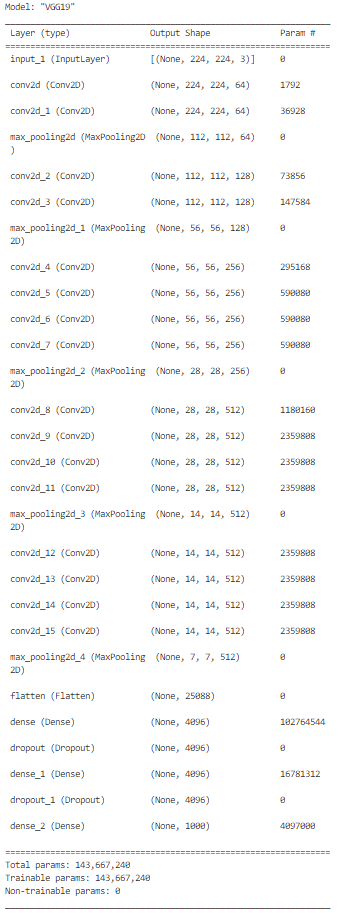
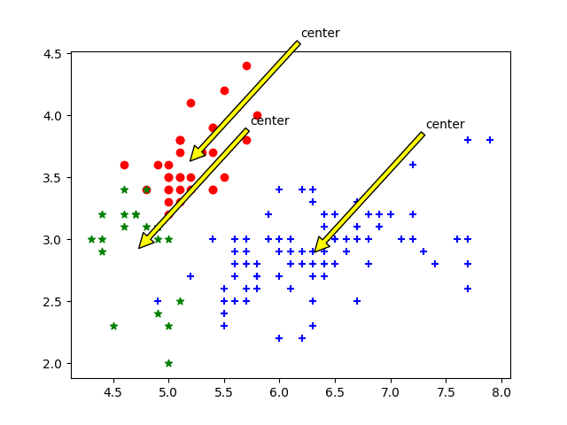
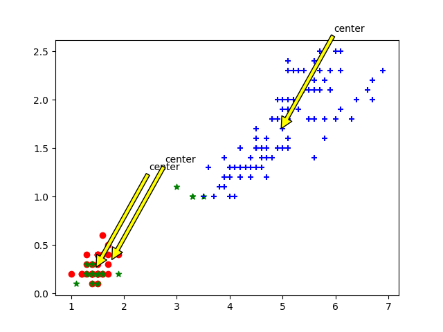
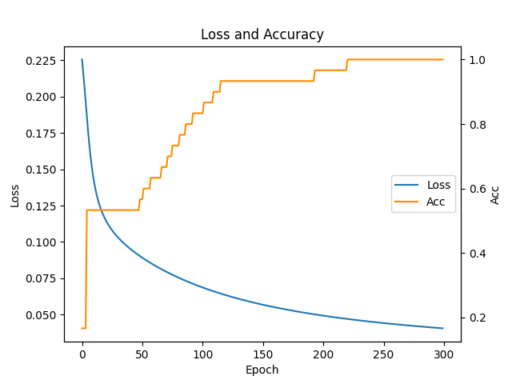
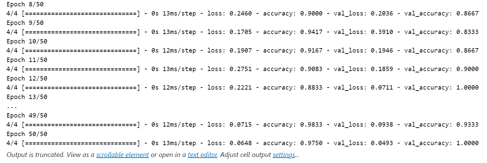
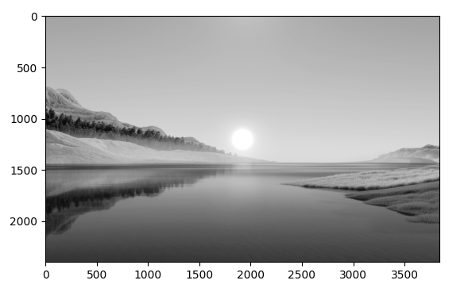
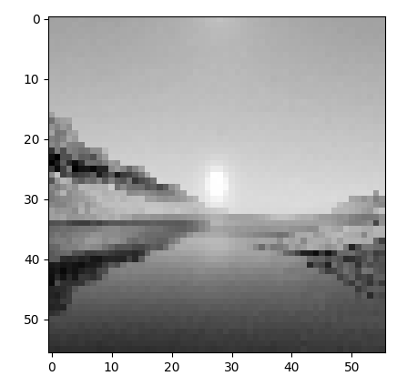
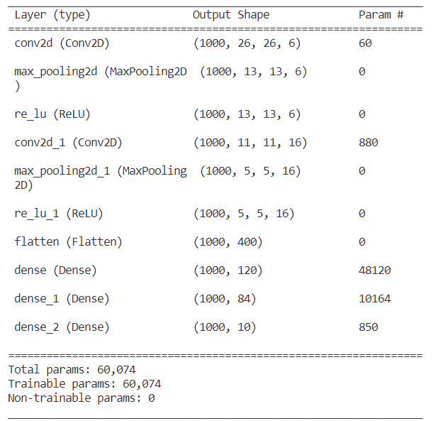
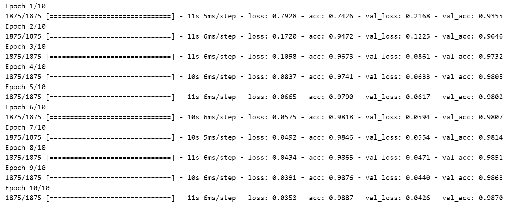

# 10.23 作业

## sect_12_6

手写汉字识别整体流程与手写数字识别（见ex_12_08）类似，受算力所限，此处仅给出所用VGG19神经网络结构

## ex_11_05

Logistic回归是一种广泛用于二元分类问题的统计分析方法。虽然它的名称中含有“回归”，但实际上它是用于分类任务的。在这里，我们将深入探讨如何通过梯度下降法手动解决Logistic回归问题。我们首先从Logistic回归模型的基本原理谈起，然后讨论梯度下降法如何应用于优化问题。

### Logistic 回归模型基础

1. **Sigmoid 函数**:
    Logistic回归使用Sigmoid函数，将线性回归结果映射到[0,1]区间，用于预测二元目标变量的概率。Sigmoid函数定义如下：  
    $$\sigma(z) = \frac{1}{1 + e^{-z}}$$  

2. **模型假设**:
   Logistic回归模型假设目标变量`y`的对数几率是输入`X`的线性组合。这里，`z`代表线性组合：`z = w^T X + b`，其中`w`是权重向量，`b`是偏差项。

3. **代价函数**:
   我们使用交叉熵损失函数，因为这会使得梯度下降优化更加有效。对于单个数据点，损失函数是：  
   $$J(w, b) = -y \log(\sigma(z)) - (1 - y) \log(1 - \sigma(z))$$  
   对于整个训练集，代价函数是所有训练样本损失的平均。

### 梯度下降求解

梯度下降是一种迭代优化算法，用于最小化代价函数。基本思想是计算代价函数的梯度，并沿着减少最快的方向调整参数。

1. **计算梯度**:
   首先，我们需要计算代价函数相对于模型参数的梯度。对于权重`w`和偏差`b`，梯度计算如下：  
   $$\frac{\partial J}{\partial w} = \frac{1}{N} \sum_{i=1}^{N} (\sigma(z^{(i)}) - y^{(i)})x^{(i)}$$  
   $$\frac{\partial J}{\partial b} = \frac{1}{N} \sum_{i=1}^{N} (\sigma(z^{(i)}) - y^{(i)})$$  
   其中`N`是训练样本的数量。

2. **更新规则**:
   然后，我们用以下规则更新参数：  
   $$w = w - \alpha \frac{\partial J}{\partial w}$$  
   $$b = b - \alpha \frac{\partial J}{\partial b}$$  
   其中，`α`是学习率，控制我们更新参数的步长。

3. **迭代优化**:
   通过多次迭代过程，我们不断用计算出的梯度更新参数，直到代价函数收敛为止。

### 算法步骤总结

1. 初始化模型参数（通常初始化为0或小的随机值）。
2. 计算模型的预测输出。
3. 计算代价函数（损失）。
4. 计算代价函数的梯度。
5. 更新模型参数。
6. 重复步骤2-5，直到满足停止准则（例如，达到预定的迭代次数，或代价函数的改变非常小）。

通过这个过程，模型最终学习到数据的权重参数，用于对新的输入数据进行预测。这就是使用梯度下降法进行Logistic回归的基本过程。实际应用中可能需要考虑更多复杂的因素，如特征缩放、正则化以及更高级的优化算法等。

### 代码实现

使用随机创建的数据集，设定学习率为0.01，收敛精度为0.0001，得到权重如下：

## ex_11_06

## ex_11_07

使用sklearn.linear_model.LogisticRegression模型进行训练，对测试集预测准确率如下：

## ex_11_08

## ex_11_09

设定聚类数为3，各类中心点坐标如下：

分别选取前两个维度和后两个维度，绘制聚类结果如下：

## ex_12_04

### 单层全连接神经网络

首先采用单层全连接神经网络进行训练，过程如下：

### 多层全连接神经网络

进一步使用多层全连接层结合Dropout训练了50轮，效果显著更优，过程及测试集表现如下：

### LSTM神经网络

接着使用常用于时间序列分析的LSTM神经网络进行训练，由于分类目标与时间序列毫不相干，效果不出意料略逊一筹，训练过程及测试集表现如下：

## ex_12_05

原图：

灰度图：

将上述灰度图缩放至（56，56）大小：

## ex_12_07

## ex_12_08

