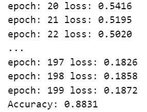

# 10.30 作业

## sect_14_4_1

同样使用stormtrooper_mask图片与a_new_hope文本，得到如下图像：

## sect_14_4_2

实践发现训练约25轮后会发生过拟合

训练25轮得到测试集准确率如下：

## ex_13_01

鸢尾花数据集散点图：

特征相关性热力图：

## ex_13_02

## ex_13_03

手写knn得到如下结果：

调用sklearn得到如下结果：

## ex_13_08

选用7中机器学习分类器分别进行训练，结果如下：

## ex_14_02

## ex_14_03

## ex_14_04

## ex_14_05

## ex_14_08

采用GCN图卷积网络进行训练，结果如下：

## ex_14_09

PCA降维得到的散点关系图略显丑陋，故采用t-SNE算法进行降维，图像如下：

