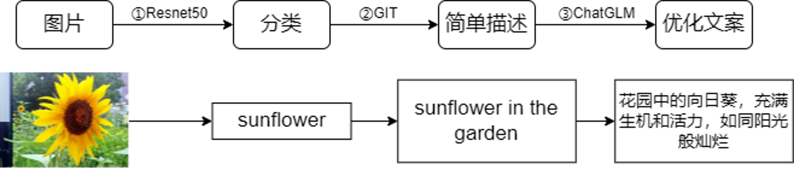

# 基于深度学习的多模态图像识别与描述生成

本项目基于mindspore完成了**图像分类**任务，提出并实现了一种**多模态文案生成**的技术方案。

## 项目结构：

本项目首先对预训练的Resnet50模型进行微调实现花数据集分类，并部署至手机端，实现了手机端的高效识别。为进一步实现文案生成，本项目使用GIT多模态模型获取图片的简单描述，再借助ChatGLM大语言模型对获得的描述信息进行加工优化，最终得到生动形象的文案。

## 参考链接：  
https://www.mindspore.cn/  
https://github.com/microsoft/GenerativeImage2Text  
https://gitee.com/mindspore/mindformers/